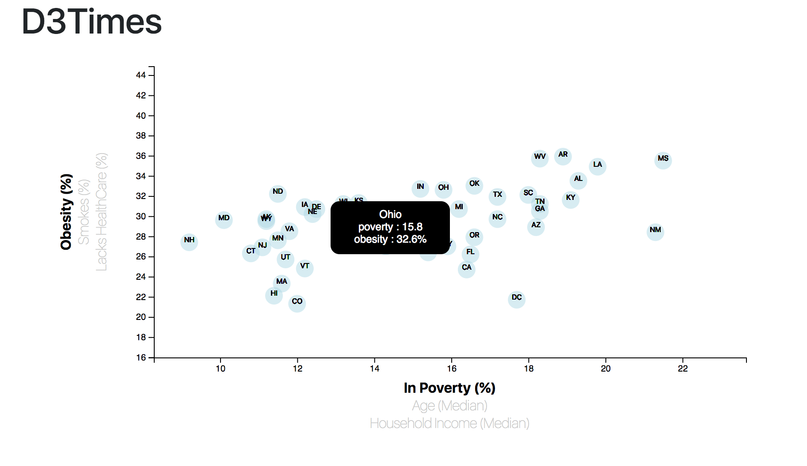

# Data-Journalism

Health risks of particular demographics

This activity explores certain associations between demographics and behavioral risk factors based on data collected from the U.S. Census Bureau and Behavioral Risk Factor Surveillance System in 2014 estimates using JavaScript library, D3. Each marker represents an individual state in the USA. Click on any of the axis titles to explore!

